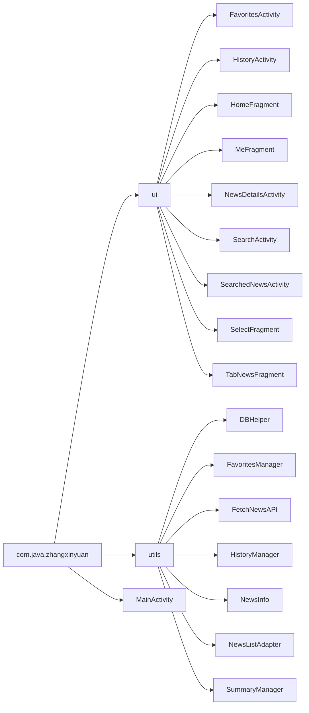

# 代码结构
整个包的结构如下所示

其中，各部分的作用功能如下：
- `ui`：应用程序的界面类，包含各种Activity和Fragment
  - `FavoritesActivity`：我的收藏界面
  - `HistoryActivity`：历史记录界面
  - `HomeFragment`：首页界面
  - `MeFragment`：我的界面
  - `NewsDetailsActivity`：新闻详情界面
  - `SearchActivity`：搜索菜单界面
  - `SearchedNewsActivity`：搜索结果界面
  - `SelectFragment`：分类选择界面
  - `TabNewsFragment`：新闻列表界面(与ViewPager2配合使用)
- `utils`：工具类，包含各种辅助功能
  - `DBHelper`：数据库帮助类，创建了本地存储的`SQL`数据库
  - `FavoritesManager`：收藏数据管理类，用于管理收藏新闻的数据
  - `FetchNewsAPI`：新闻数据获取类，用于从接口获取新闻数据
  - `HistoryManager`：历史记录管理类，用于管理历史记录的数据
  - `NewsInfo`：新闻信息类，是`Gson`将`JSON`格式的新闻数据转换成的`Java`类
  - `NewsListAdapter`：新闻列表适配器，用于将新闻数据适配到`RecyclerView`中
  - `SummaryManager`：摘要管理类，用于管理新闻摘要的数据
- `MainActivity`：应用程序的主界面

# 具体实现
## 新闻列表
### 列表基本展示
- 由于需要实现上下滑动功能，所有新闻列表(主界面、浏览记录、我的收藏、搜索结果)都使用了`RecyclerView`进行布局。
- 其中，主界面由于需要实现根据分类不同选择性展示新闻的功能，所以使用了`TabLayout`绑定`ViewPager2`后将`RecylerView`嵌入`ViewPager2`的方式进行展示
### 点击进入新闻详情页
- 在适配器`NewsListAdapter`中定义了一个接口`OnItemClickListener `，其中包含一个方法`onItemClick`。 
- 然后创建一个该接口的实例`mOnItemClickListener`，并在`onBindViewHolder`方法中为每个`RecyclerView`的子项设置点击事件监听器，当子项被点击时，调用`onItemClick`方法，并传入相应的参数。 
- 最后，在新闻列表界面为`RecyclerView`的适配器具体实现该接口，使得当`RecylerView`中的子项被点击时，都启动一个新的`NewsDetailsActivity`并跳转
### 下拉刷新
- 使用`SwipeRefreshLayout`包裹`RecyclerView`，并在新闻列表界面中为其设置下拉刷新事件的监听器`swipeRefreshLayout`，使得每次下拉时重新开始获取新闻数据，并更新`RecycleView`的适配器`NewsListAdaper`
### 上拉加载
- 在布局中添加`ProgressBar`组件，并为`RecycleView`设置上拉事件的监听器`recyclerView.addOnScrollListener`。当监听到上拉事件时，会显示该`ProgressBar`并开始获取下一页的数据。当数据获取完毕后，会再次设置此`ProgressBar`为不可见
### 搜索功能
- 在需要实现搜索功能的组件中(主界面、新闻详情页)中含有一个搜素功能的`Button`，当点击此`Button`后开启一个`SearchActivity`并跳转到新闻搜索菜单。 
- 在搜索菜单界面，提供了`SearchView`进行关键词的获取、`CheckBox`提供了分类的选择，`DatePicker`提供了开始和结束日期的选择。 
- 当`SearchView`监听到文本提交时，会进行新闻数据的获取，并跳转到`SearchedActivity`界面展示搜索结果
## 列表分类
- 在主界面(`HomeFragment`)中设置了一个`ImageButton`。当点击此`ImageButton`后会弹出`SelectFragment`以供分类的删除和添加
- `HomeFragment`和`SelectFragment`之间使用`Bundle`进行通信，告知彼此分类的增删情况
- 在`SelectFragment`中，使用`ObjectAnimator`为分类代表的`Button`设置抖动特效和点击时的水平振动特效
## 新闻详情
### 内容展示
- 启动新闻详情时，前一个`Activity`或`Fragment`会通过`Intent`将新闻数据`NewsInfo.DataDTO`传递过来。新闻详情界面(`NewsDetailsActivity`)会根据这些数据设置自己的标题、来源、时间、图片、摘要和视频等信息的展示情况
### 视频播放
- 视频播放使用`VideoView`组件进行展示，并使用`MediaController`类来为为视频的播放提供交互
### GLM摘要生成
- 在新闻详情界面(`NewsDetailsActivity`)中，使用`getSummaryInBackground`方法异步调用`API`获取`GLM`生成的摘要。当摘要获取成功后，替换摘要组块的默认文本*生成中，请稍后...*'
- 摘要生成成功后，使用`SummaryManager`将生成的摘要存储到本地数据库中，在下次打开新闻详情时，如果摘要已经生成，则直接从数据库中读取摘要，否则再次调用`API`生成摘要
## 本地记录
### 数据存储
- 使用`SQLite`数据库存储浏览记录和收藏记录。在每次启动`NewsActivity`和点击收藏按钮时，选择将该新闻添加到历史记录或我的收藏数据库中
### 灰色标记
- 在`RecyclerView`绑定子项数据时，查询该新闻是否在`history`表中存在，如果存在即设置标题颜色为灰色
### 记录展示
- 当点击我的界面(`MeFragment`)中的浏览记录或我的收藏Button时，分别启动`HistoryActivity`和`FavoritesActivity`展示浏览记录和我的收藏，并使用`HistoryActivity`和`FavoritesActivity`以展示记录。其具体实现类似`TabNewsFragment`
# 总结与心得
## 总结
在本次作业之前，我对`Java`和`Android`开发都停留在只知皮毛的阶段，面对复杂的`Android Studio`和繁多的作业要求，加之开始时间较晚，我几乎只有五天的时间完成本次大作业，这不仅令我心中颇为忐忑。
于是，我从视频平台和博客网站中开始几乎零基础的学习。从不求甚解地写下教程中的代码，到初窥门径，能在`ChatGPT`的辅助下半自主写代码，再到小有心得，能自定义和添加功能……这个过程并不好受，de不出bug时也足够让人抓狂，但最后的成就感却是的的确确令人欣喜的。最后，几乎只用时三天，我便完成了本次大作业。
而本次作业给我最大的体会便是：代码最重要的还是写，不管你目前对于所写内容懂得多少，只要肯花力气写，便能很快得到提升。最忌讳的便是只读代码和看教程而不自己实操，这样的进步是十分缓慢的。
## 建议
大部分同学在本次作业之前都从未接触过`Andriod` app开发，也几乎没有独立开发软件的经验。而我们的大作业只给出了要求，而没有一些具体的开发步骤指导，这是对同学们上手开发颇不友好。
因此，我认为，可以为大作业提供一些具体的开发步骤，或者在大作业前设置一些搭好了大致框架的小作业以帮助同学们更快上手大作业。